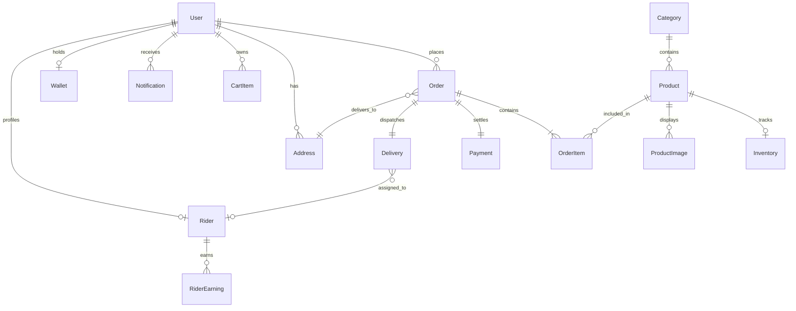

# DevVegis — Project Overview & Architecture Guide

> **DevVegis** is a production-grade, hyper-local quick-commerce and wholesale platform built for fresh produce (vegetables, fruits, organic staples, and exotic greens). It connects dark store fulfillment hubs with consumers and wholesale buyers in **10–15 minute delivery cycles**.

---

## 1. Executive Summary

DevVegis bridges farm-to-table supply chains with modern quick-commerce speed. The platform solves the dual problem of retail grocery delivery and B2B wholesale bulk supply:
- **Retail Consumers (B2C)** get 10–15 minute doorstep delivery with real-time tracking, recipe bundle one-click ordering, dynamic delivery discounts, and strict OTP-verified handovers.
- **Wholesale Buyers (B2B)** access wholesale tier pricing, minimum order quantities (MOQ), GST-compliant invoicing, and priority warehouse dispatch.
- **Riders (Delivery Fleet)** have an optimized field app for receiving dark store assignments, navigation, order bill and COD collection summaries, and delivery completion via customer OTP verification.
- **Dark Store Operators & Admins** control live multi-station inventory, dynamic surge pricing, rider assignments, catalog media uploads, and revenue analytics.

---

## 2. Technology Stack & Infrastructure

```
┌────────────────────────────────────────────────────────────────────────┐
│                        FRONTEND (Next.js 15 App Router)               │
│   • React 19 + TypeScript          • Tailwind CSS v4                   │
│   • Zustand (Client State & Cart)  • TanStack React Query (Live Polling│
│   • Framer Motion (Animations)     • Lucide React + Sonner Toasts      │
└───────────────────▲────────────────────────────────────────────────────┘
                    │ REST API + Cookies / Bearer JWT
┌───────────────────▼────────────────────────────────────────────────────┐
│                        BACKEND API (Node.js & Express)                 │
│   • Express + TypeScript           • Prisma ORM v5                     │
│   • Zod & Express-Validator        • Winston Logger & Morgan           │
│   • Helmet, CORS & Rate-Limiting   • Swagger UI (/api-docs)            │
└───────▲──────────────────────▲──────────────────────────▲──────────────┘
        │                      │                          │
        ▼                      ▼                          ▼
┌──────────────┐      ┌─────────────────┐       ┌─────────────────┐
│ Neon Postgres│      │ Neon S3 Storage │       │   Resend API    │
│  (Database)  │      │  (Images/Media) │       │ (Transactional) │
└──────────────┘      └─────────────────┘       └─────────────────┘
```

| Layer | Technology | Rationale & Responsibility |
| :--- | :--- | :--- |
| **Frontend Framework** | Next.js 15 (App Router) + React 19 | Server and Client component separation, route handlers, high-speed SSR, and SEO-optimized metadata. |
| **Styling & Motion** | Tailwind CSS v4 + Framer Motion | High-density hyper-local design, animated transitions, dark mode support, and micro-interactions. |
| **State & Data Fetching** | Zustand + TanStack Query | Zustand manages persistent client cart and authentication state; React Query manages cache invalidation and live status polling. |
| **Backend Framework** | Node.js + Express + TypeScript | Lightweight, high-throughput REST architecture with custom async error handlers and modular routes. |
| **ORM & Database** | Prisma ORM + Neon PostgreSQL | Type-safe schema definition, database migrations, connection pooling via PgBouncer, and scale-to-zero efficiency. |
| **Object Storage** | Neon Object Storage / AWS S3 API | S3-compatible cloud storage for product photography and user uploads with pre-signed URL generation. |
| **Email Service** | Resend API | Reliable transactional delivery of 4-digit order delivery OTPs and order invoices. |
| **Payments** | Razorpay Sandbox / Live + COD + Wallet | Multi-mode checkout supporting UPI, Cards, Net Banking, Internal Wallet balance, and Cash on Delivery. |

---

## 3. Four Core Portals & User Roles

### 3.1 Customer Storefront (`/`)
* **Dynamic Catalog & Search**: Categorized produce (Leafy Greens, Organic, Root Veggies, Fruits, Seasonings) with instant search filtering by name, Hindi vernacular names, and tags.
* **Recipe Bundles**: Pre-curated bundles (e.g., *Palak Paneer Kit*, *Sambar Box*, *Salad Bowl*) adding all required ingredients to the cart with one click.
* **Smart Cart & Validation**: Multi-strategy product resolution during checkout. Supports promo codes, internal wallet balance credits, and free delivery thresholds.
* **Live Order Tracking (`/orders/[id]`)**:
  - Real-time animated 4-stage tracking: `CONFIRMED` $\rightarrow$ `PACKED` $\rightarrow$ `ON_THE_WAY` $\rightarrow$ `DELIVERED`.
  - **Customer Delivery OTP Card**: Bold 4-digit code with single-tap clipboard copy and an **"Email" re-send button** powered by Resend.
  - Interactive Leaflet delivery map displaying the dark store hub, delivery partner location, and destination pin.

### 3.2 Wholesale Buyer Portal (`/wholesale`)
* Tailored for restaurants, cloud kitchens, juice bars, and retail vendors.
* Shows wholesale tier pricing (discounted rates per kg/crate) once authenticated as `WHOLESALE_BUYER`.
* Displays Minimum Order Quantities (MOQ), estimated commercial savings, and GST invoicing data.

### 3.3 Rider Delivery Portal (`/rider`)
* Dedicated mobile-friendly dashboard for fleet partners.
* **Active Orders Queue**: Displays assigned deliveries with distance from Dark Store Hub, order bill total, COD collection indicators, and phone call shortcuts.
* **Two-Step Fulfillment**:
  1. `Confirm Picked`: Confirms pickup from dark store dispatch station.
  2. `Deliver`: Requires entering the customer's 4-digit OTP.
* **Security Barrier**: The customer's OTP is **never** shown on the rider portal or included in the rider API payload. The rider must request the code verbally from the customer upon handover.
* **Rider Earnings**: Instant ₹50 payout credited to rider balance upon successful OTP verification.

### 3.4 Admin & Operations Hub (`/admin`)
* **Dashboard (`/admin`)**: High-level telemetry showing today's revenue, order counts, active riders, low-stock warnings, and recent transactions.
* **Catalog Manager (`/admin/products`)**: Add/edit vegetables and fruits, stock levels, organic tags, wholesale pricing, and upload images directly to Neon S3 Object Storage.
* **Order Operations (`/admin/orders`)**: Live order command center with filter by status, manual assignment to riders, and invoice inspection.
* **Fleet Command (`/admin/riders`)**: Real-time status of on-duty delivery partners, active routes, approval workflows, and lifetime ratings.

---

## 4. Database Architecture & Data Models

The database is built on **PostgreSQL** via **Prisma ORM**. All IDs use RFC 4122 UUIDs.



### Key Models & Their Functions

1. **User & Auth**:
   - `Role`: `CUSTOMER`, `WHOLESALE_BUYER`, `RIDER`, `ADMIN`.
   - Stores bcrypt-hashed passwords, phone numbers, and optional GST numbers for wholesale buyers.
2. **Product & Inventory**:
   - `Product`: Title, slug, description, category, unit (e.g. `250g`, `500g`, `1kg`), base retail price, and `wholesalePrice`.
   - `Inventory`: Separate table tracking `availableStock`, `reservedStock`, `lowStockThreshold`, and batch details for transactional safety.
   - `ProductImage`: URLs hosted on Neon S3 or fallback CDNs.
3. **Order & Delivery Engine**:
   - `Order`: Order number (`DVxxxxxxxx`), status (`PENDING`, `CONFIRMED`, `PACKED`, `ON_THE_WAY`, `DELIVERED`, `CANCELLED`), financial breakdown (subtotal, delivery fee, GST, discounts, wallet used, total), and `deliveryOtp`.
   - `Delivery`: Delivery partner assignment, latitude/longitude, timestamp logs (`acceptedAt`, `pickedUpAt`, `deliveredAt`), and `otpVerified` boolean flag.
4. **Financial Ledger**:
   - `Payment`: Transaction status (`PENDING`, `PAID`, `FAILED`), payment method (`CASH_ON_DELIVERY`, `RAZORPAY`, `UPI`, `WALLET`), and gateway payment ID.
   - `Wallet` & `WalletTransaction`: In-app store credit engine for customer cashbacks, refunds, and instant checkout credits.
   - `RiderEarning`: Audit log of delivery fees (₹50 base per drop) and incentive bonuses.

---

## 5. Security & Business Logic Highlights

### 5.1 The 4-Digit Delivery OTP Handshake
```
1. Customer places order
      │
      ├─► Generates secure 4-digit OTP (e.g. '4821')
      ├─► Stored in Database (order.deliveryOtp)
      ├─► Dispatched to Customer Email via Resend API
      └─► Visible ONLY on Customer App (/orders/[id])
            │
2. Delivery partner reaches doorstep
      │
      ├─► Rider App DOES NOT have the OTP (stripped in API)
      ├─► Rider requests code verbally from Customer
      ├─► Rider enters code into Rider Portal
      └─► Backend verifies: inputOtp === order.deliveryOtp
            │
            ├─► Match: Order -> DELIVERED, Rider receives ₹50 payout
            └─► Mismatch: 400 Bad Request error returned
```

### 5.2 Stock Reservation & Transaction Integrity
When a customer checks out, order creation, delivery record initialization, inventory decrement, wallet debit, and cart clearance run inside a **Prisma ACID Transaction (`prisma.$transaction`)** with a 30-second timeout. If stock runs out or wallet balances fail, all state mutations roll back cleanly.

### 5.3 Resilient Product Matching
In fast-moving inventory scenarios, the checkout engine matches cart items through a multi-strategy cascade (by database UUID, slug, exact name match, or staple fallback). This prevents cart drops due to seed-data ID discrepancies between development sessions.

### 5.4 Database Scale-to-Zero Handling
Because Neon serverless PostgreSQL suspends compute during inactivity to save costs, the backend middleware includes automatic retry mechanisms and DNS IPv4-first resolution to prevent connection dropouts when waking from sleep.

---

## 6. Directory Structure & Key Files

```
devvegis/
├── client/                     # Next.js 15 Frontend
│   ├── app/
│   │   ├── (auth)/             # Login, Register, Forgot Password
│   │   ├── (store)/            # Customer catalog, cart, checkout, orders/[id]
│   │   ├── admin/              # Admin control center (products, orders, riders)
│   │   ├── rider/              # Delivery partner operational portal
│   │   ├── wholesale/          # B2B bulk pricing & catalog
│   │   └── layout.tsx          # Root layout with TanStack Query & Toast providers
│   ├── components/             # Reusable UI cards, navigation, and modals
│   ├── lib/api.ts              # Axios client with JWT auto-refresh interceptors
│   └── store/                  # Zustand stores (useCartStore, useAuthStore)
│
├── server/                     # Express + TypeScript Backend
│   ├── src/
│   │   ├── config/             # Environment, Prisma client, Swagger
│   │   ├── middleware/         # JWT auth, role guard, rate limiters, error handlers
│   │   ├── modules/            # Domain-driven architecture modules:
│   │   │   ├── auth/           # Login, signup, token rotation
│   │   │   ├── orders/         # Order creation, OTP dispatch, cancellation
│   │   │   ├── riders/         # Rider fleet routing, delivery verification
│   │   │   ├── upload/         # S3 Object Storage presigned upload handler
│   │   │   └── products/       # Produce catalog & inventory
│   │   ├── utils/
│   │   │   ├── email.ts        # Resend SDK client & responsive OTP email templates
│   │   │   ├── s3.ts           # Neon S3 / AWS S3 client wrapper
│   │   │   └── logger.ts       # Winston structured logger
│   │   └── index.ts            # Express server initialization & routes
│   └── prisma/
│       └── schema.prisma       # Database schema definition
│
├── docs/                       # Project and Deployment Documentation
│   ├── PROJECT_OVERVIEW.md     # Architectural & feature blueprint
│   └── DEPLOYMENT_GUIDE.md     # Production rollout manual for DevOps / EM
└── scripts/                    # Test suites & utility verification scripts
```
